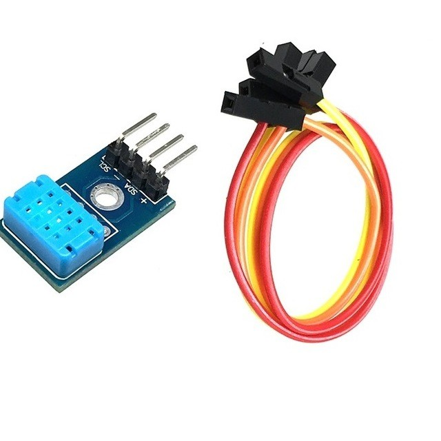

# DE2_project
* Dominik Choutka
* Jan Jakoubek
* Filip Aujeský
* Vít Charvátek

## Teoretický popis
Cílem projektu by bylo vytvořit systém, který by měřil klíčové parametry prostředí (např. teplotu, vlhkost, úroveň osvětlení, vlhkost půdy) pro tropické rostliny. Tento systém by měl také umožnit uživateli kontrolovat nebo upravovat podmínky prostředí a vizualizovat údaje.

## Popis hardware použitého při projektu

### Arduino UNO

Arduino Uno je populární mikrokontrolerový vývojový kit založený na čipu ATmega328P. Je vhodný pro začátečníky i pokročilé díky jednoduchosti a rozsáhlé podpoře komunity. Deska obsahuje 32 KB paměti Flash, 2 KB SRAM a pracuje na frekvenci 16 MHz. Arduino Uno je ideální pro prototypování i vzdělávání díky své všestrannosti a open-source platformě.

Deska nabízí 14 digitálních pinů (6 s PWM) a 6 analogových vstupů. Digitální piny pracují s napětím 5 V, což umožňuje připojení LED diod, tlačítek či relé. Analogové vstupy jsou určeny pro čtení senzorů s rozlišením 10 bitů. K dispozici jsou i komunikační rozhraní UART, SPI a I2C, která usnadňují připojení periferií.

Napájení je možné přes USB nebo externí zdroj (7–12 V), s integrovaným regulátorem napětí. Arduino Uno je univerzální nástroj pro rychlé prototypování a tvorbu elektronických projektů.

### OLED Displej

OLED displej s rozhraním I2C, 0,96" s rozlišením 128x64 pixelů, je kompaktní zobrazovací modul ideální pro Arduino a další mikrokontroléry. Díky technologii OLED má vysoký kontrast, jasné zobrazení a nízkou spotřebu energie, což je vhodné pro přenosné projekty.

Displej využívá dvouvodičovou I2C komunikaci, což šetří piny mikrokontroléru. Standardně pracuje s napětím 3,3–5 V, takže je kompatibilní s většinou vývojových desek. Umožňuje zobrazovat text, grafiku i jednoduché animace, což z něj dělá všestranný nástroj pro různé aplikace.

### Půdní vlhkoměr

Půdní analogový vlhkoměr s antikorozní sondou je jednoduchý a efektivní senzor pro měření vlhkosti půdy. Využívá dvě elektrody, které detekují množství vody v půdě na základě její vodivosti. Díky antikorozní úpravě je senzor odolný vůči dlouhodobému použití v náročných podmínkách.

Senzor pracuje s napájecím napětím 3,3–5 V a poskytuje analogový výstup, který lze snadno číst pomocí mikrokontroléru, jako je Arduino. Hodnota na výstupu odpovídá úrovni vlhkosti půdy, což umožňuje například automatické zavlažování nebo monitorování rostlin. Uplatní se v projektech, jako jsou chytré zahrady, skleníky nebo zemědělské aplikace.

### Klávesnice

Analogová klávesnice je kompaktní modul umožňující detekci více tlačítek pomocí jediného analogového vstupu. Tlačítka jsou zapojena do rezistorového děliče, což umožňuje generovat odlišné napěťové úrovně pro každé stisknutí. Analogová hodnota na výstupu odpovídá konkrétnímu tlačítku, což usnadňuje programování a integraci do projektů.

Klávesnice je ideální pro jednoduchá uživatelská rozhraní v různých projektech. Díky úspoře pinů je vhodná i pro zařízení s omezeným počtem vstupů.

### DHT12

DHT12 je digitální senzor pro měření teploty a vlhkosti s podporou I2C rozhraní. Nabízí přesnost ±0,5 °C u teploty a ±5 % u vlhkosti.Pracuje s napětím 2,7–5,5 V a díky I2C šetří piny mikrokontroléru. Je kompatibilní s Arduinem a dalšími platformami, přičemž podporuje i jednožilové datové rozhraní.

## Popis software

## Ovládání
